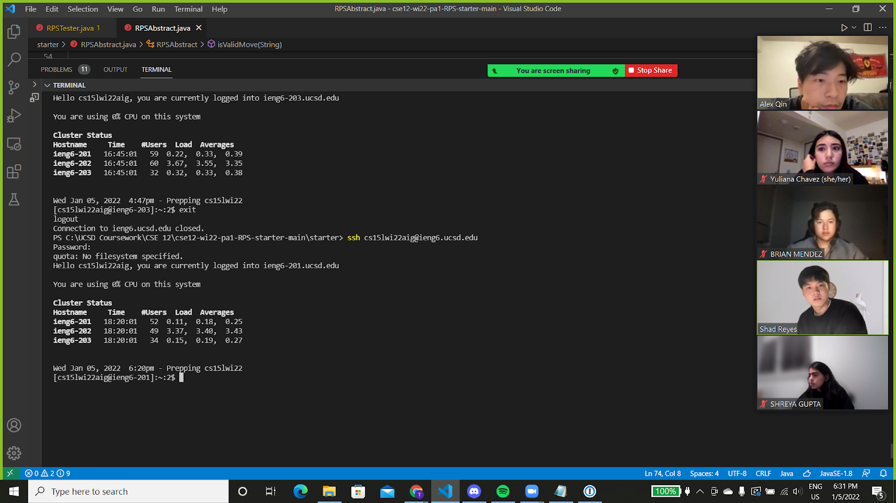

# Lab Report 1, Week 2

## Installing VScode

## Remotely Connecting

## Trying Some Commands

---

---

---

---

---

---

## Moving Files with scp

## Setting an SSH Key

## Optimizing Remote Running