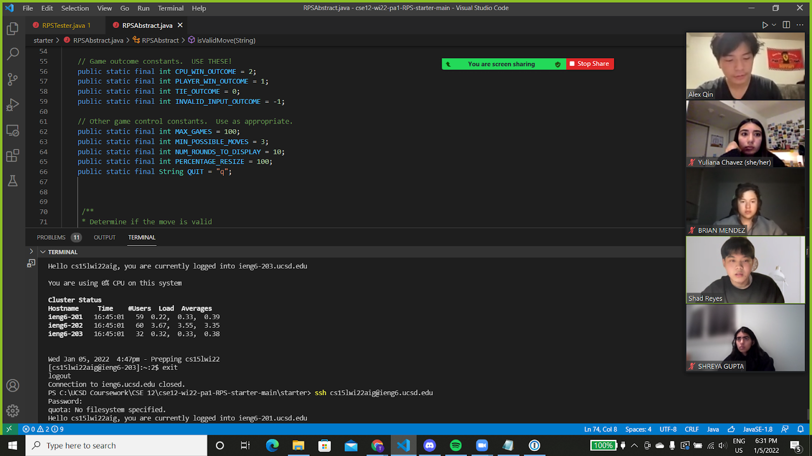

# Lab Report 1, Week 2

## Installing VScode

I had experience with VS Code before, so I downloaded it before. Either way, just go follow the instructions on VS Code online to download. [VS Code Instructions can be found here.](https://code.visualstudio.com/) 


## Remotely Connecting

First, I installed [OpenSSH](https://docs.microsoft.com/en-us/windows-server/administration/openssh/openssh_install_firstuse). Then, after finding my [CSE15L account](https://sdacs.ucsd.edu/~icc/index.php), I used the ssh cs15lwi22aigieng5.ucsd.edu command. After putting in my password, I was able to login. 

## Trying Some Commands

---

---

---

---

---

---
Tested out commands the various terminal commands, including:
```
cd
ls
pwd
mkdir
cp
```
I tried them out either on my computer or on the remote computer after ssh-ing. Some images showing the results are above. 

## Moving Files with scp


Made a file called WhereAmI.java, then used scp on it to send it to my UCSD remote computer. After logging on, I did javac and java to read the contents inside WhereAmI.java and it ran successfully. 

## Setting an SSH Key

Ran ssh-key gen on VS Code. Let it save at the default location and entered a passphrase for it. 


Logged onto Powershell as an administrator. Followed instructions on Microsoft's instructions on [ssh-add steps.](https://docs.microsoft.com/en-us/windows-server/administration/openssh/openssh_keymanagement#user-key-generation)


Went back to VS Code and made the .ssh directory on there. Then, logging out, on my local computer, I ran an scp command to send ssh file from my computer to the UCSD remote computer. Afterwards, I was able to get in with just my passphrase. 


## Optimizing Remote Running

Wrote down a combined command in the notepad app for later reference and use. Already had the notepad open, so I just added the `scp WhereAmI.java cs15lwi22aig@ieng6.ucsd.edu:~/; ssh cs15lwi22aig@ieng6.ucsd.edu "javac WhereAmI.java; java WhereAmI"`. 
- 1 keystroke (a click to bring up the notepad) 
- 1 keystroke to select all of `scp WhereAmI.java cs15lwi22aig@ieng6.ucsd.edu:~/`, which was already in my notepad 
- 2 keystrokes to paste it into a new line of notepad 
- 1 keystroke to select all of `ssh cs15lwi22aig@ieng6.ucsd.edu`
- 3 strokes to click line with `scp WhereAmI.java cs15lwi22aig@ieng6.ucsd.edu:~/` and put in `; ` (including a space)
- 1 stroke to Crtl-V to paste in `ssh cs15lwi22aig@ieng6.ucsd.edu`
- 1 click to open up Visual Studio Editor 
- 1 click to activate the terminal
- 3 strokes when I pressed the up button 3 times to select the `javac WhereAmI.java` command
- 1 click to get back to the notepad
- 4 strokes to click on the last row and 2 keystrokes to add ` ""` (including a space)
- 1 stroke using Ctrl-V to paste in `javac WhereAmI.java` in between the quotations
- 2 strokes to add `; ` (including space) after `javac WhereAmI.java` within quotations
- 9 strokes to repeat the process for `java WhereAmI`

In total, this took about 31 keystrokes to make the combined command. 


- 1 click to open up Visual Studio code, where I will edit it locally 
- 3 strokes to copy and paste `System.out.println("bye")` 
- 2 strokes to select and delete bye within the quotes
- 4 strokes to type out "fine"

All of this took 10 strokes. 


- 1 stroke to bring up the terminal by clicking on it
- 1 keystroke to select the notepad tab
- 2 strokes to copy and paste the entire command
- 1 stroke to select the Visual Studio Editor again
- 1 stroke to select the terminal
- 2 strokes to paste the command in and run it. 
- 6 strokes after asking for my passphrase, I typed it in and entered 
- 6 strokes after asking for my passphrase again

This took 20 strokes in total.  

Now, when I needed to use it, it would be ready for me to use and run faster with by running the 3 commands in a row without my typing in. 

While making the combined command line, editing the code, and running it in the terminal took 61 strokes. 

However, if I need to repeat the process, I won't have to make new command lines, so it would only take 30 strokes. 
