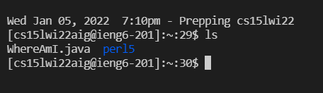
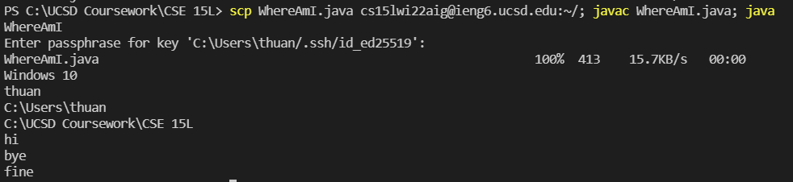

# Lab Report 1, Week 2

## Installing VScode

I had experience with VS Code before, so I downloaded it before. Either way, just go follow the instructions on VS Code online to download. (https://code.visualstudio.com/) 

## Remotely Connecting

First, I installed OpenSSH (https://docs.microsoft.com/en-us/windows-server/administration/openssh/openssh_install_firstuse). Then, after finding my CSE15L account (https://sdacs.ucsd.edu/~icc/index.php), I used the ssh cs15lwi22aigieng5.ucsd.edu command. After putting in my password, I was able to login. 

## Trying Some Commands

---

---

---

---

---

---
Tested out commands the various terminal commands like cd, ls, pwd, mkdir, cp, etc. I tried them out either on my computer or on the remote computer after ssh-ing. Some images showing the results are above. 

## Moving Files with scp

Made a file called WhereAmI.java, then used scp on it to send it to my UCSD remote computer. After logging on, I did javac and java to read the contents inside WhereAmI.java and it ran successfully. 

## Setting an SSH Key

Ran ssh-key gen on VS Code. Let it save at the default location and entered a passphrase for it. 

Logged onto Powershell as an administrator. Followed instructions on Microsoft's instructions on ssh-add steps. (https://docs.microsoft.com/en-us/windows-server/administration/openssh/openssh_keymanagement#user-key-generation)

Went back to VS Code and made the .ssh directory on there. Then, logging out, on my local computer, I ran an scp command to send ssh file from my computer to the UCSD remote computer. Afterwards, I was able to get in with just my passphrase. 

## Optimizing Remote Running

Wrote down a combined command in the notepad app for later reference and use. When I needed to use it, it would be ready for me to use and run faster with by running the 3 commands in a row without my typing in. This was done by copying the long command itself and pasting it into the command line. 