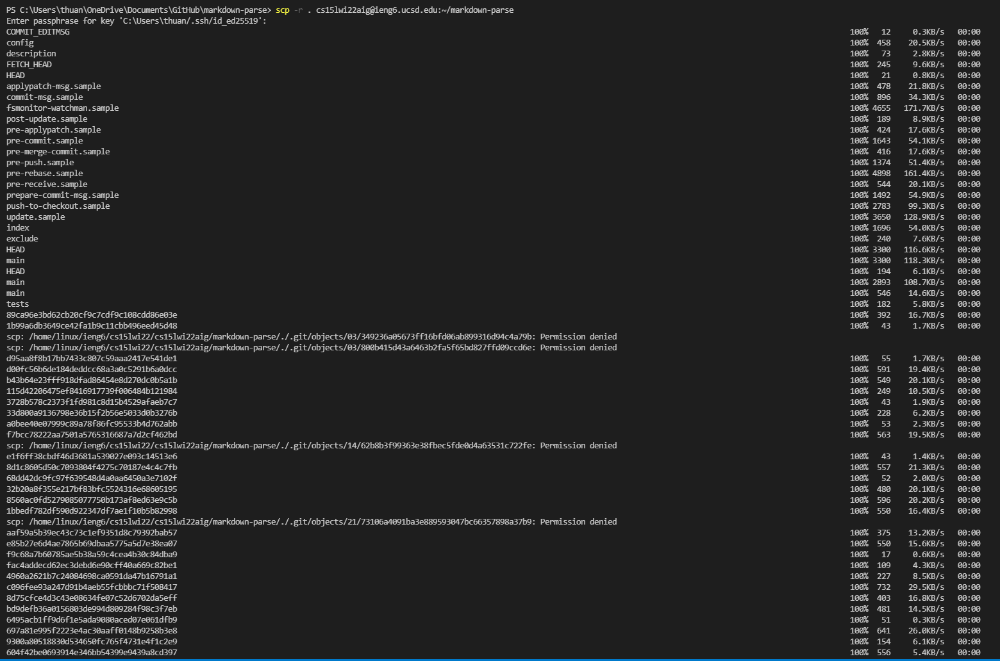
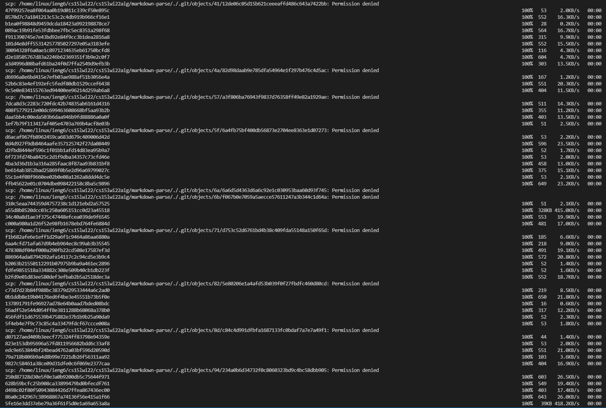
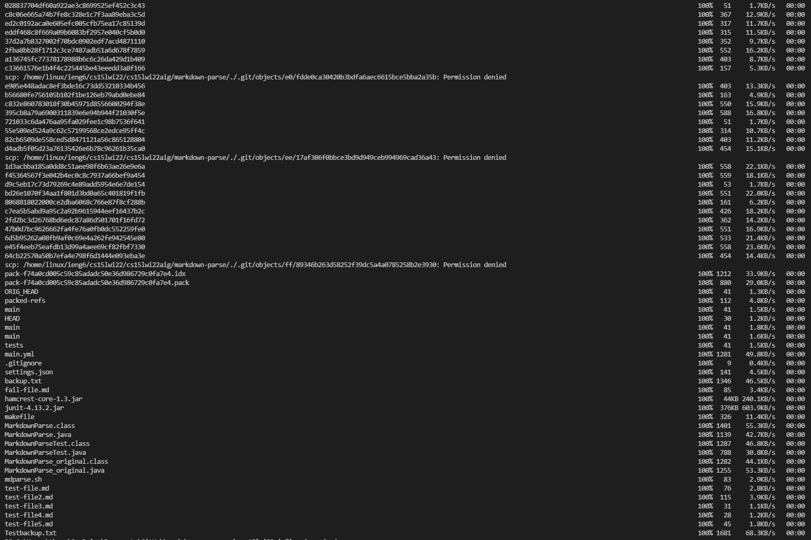
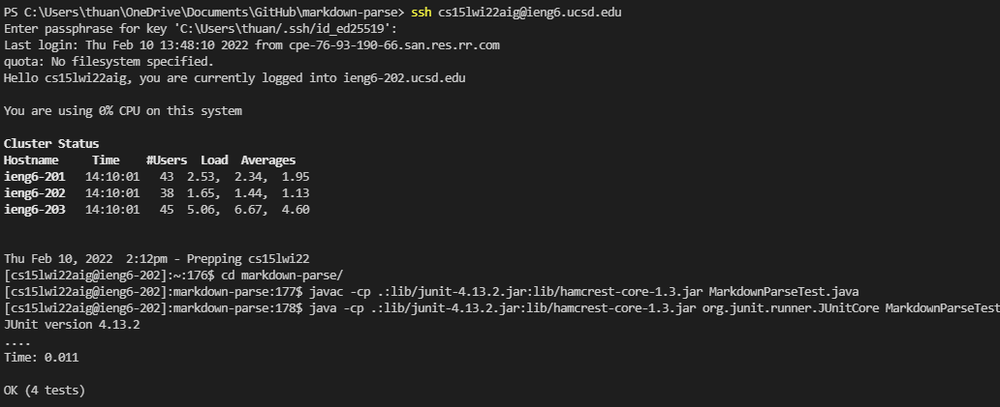
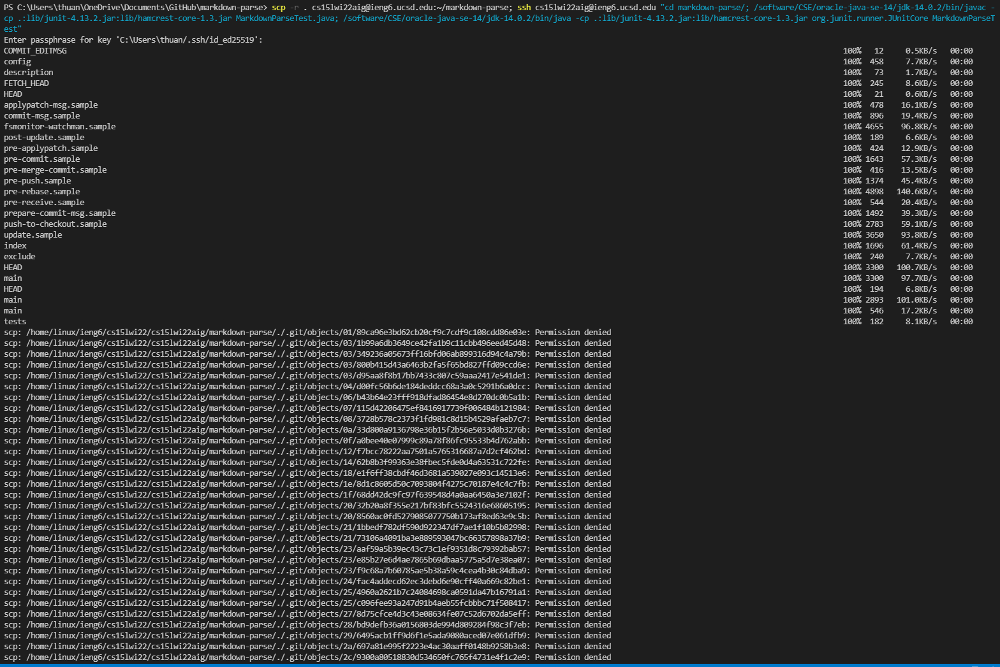
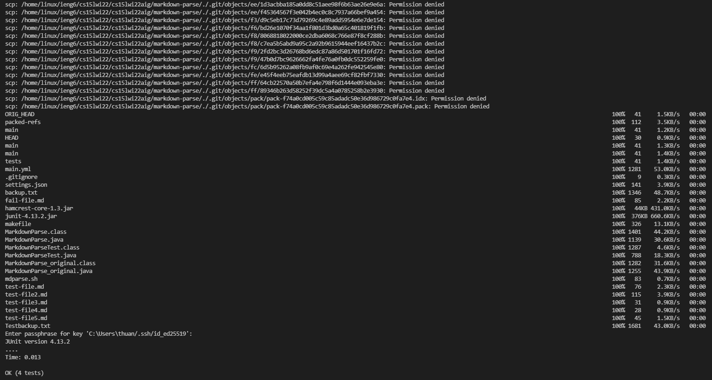

# Lab Report 3, Week 6

## Copying Whole Directory to ieng6

- Using the command `scp -r . cs15lwi22aig@ieng6.ucsd.edu:~/markdown-parse`, I was able to copy my entire `markdown-parse` directory to my ieng6 account. 
- After asking me for my passphrase, it then proceeded to copy everything in said directory to ieng6. 

## Log into ieng6 and compile and run tests

- After logging into the ieng6 account by using the command `ssh cs15lwi22aig@ieng6.ucsd.edu`, I went into the `markdown-parse` directory by using the command `cd markdown-parse/`. This was done to ensure that my terminal could read and access the `MarkdownParseTest` files. 
- Afterwards, I ran the command `javac -cp .:lib/junit-4.13.2.jar:lib/hamcrest-core-1.3.jar MarkdownParseTest.java` to compile the `MarkdownParseTest` file. 
- Then, I ran `java -cp .:lib/junit-4.13.2.jar:lib/hamcrest-core-1.3.jar org.junit.runner.JUnitCore MarkdownParseTest` command to run the tests, which ran successfully and showed that all four tests in the file had succeeded. 

## One line command

At first, I had trouble with my one line command. 
- First, I used `scp -r . cs15lwi22aig@ieng6.ucsd.edu:~/markdown-parse; ssh cs15lwi22aig@ieng6.ucsd.edu "cd markdown-parse/; javac -cp .:lib/junit-4.13.2.jar:lib/hamcrest-core-1.3.jar MarkdownParseTest.java; java -cp .:lib/junit-4.13.2.jar:lib/hamcrest-core-1.3.jar org.junit.runner.JUnitCore MarkdownParseTest"`. This ran into issues with the ieng6 compiler, which seems to have the wrong paths according to [Professor Politz](https://piazza.com/class/kxs0toocqhv4og?cid=354) and an [online post](https://unix.stackexchange.com/questions/332531/why-does-remote-bash-source-bash-profile-instead-of-bashrc).
- With the help of TA Rachel Lim and Mr. Politz's workaround, I changed the command to `scp -r . cs15lwi22aig@ieng6.ucsd.edu:~/markdown-parse; ssh cs15lwi22aig@ieng6.ucsd.edu "cd markdown-parse/; /software/CSE/oracle-java-se-14/jdk-14.0.2/bin/javac -cp .:lib/junit-4.13.2.jar:lib/hamcrest-core-1.3.jar MarkdownParseTest.java; /software/CSE/oracle-java-se-14/jdk-14.0.2/bin/java -cp .:lib/junit-4.13.2.jar:lib/hamcrest-core-1.3.jar org.junit.runner.JUnitCore MarkdownParseTest"`. Essentially, what changed was that I used `/software/CSE/oracle-java-se-14/jdk-14.0.2/bin/java` to replace the `java` part of the command and `/software/CSE/oracle-java-se-14/jdk-14.0.2/bin/javac` to replace the `javac` part of the command. This allowed the program to execute copying the entire directory and run the tests in one line. 