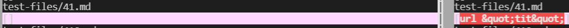

# Lab Report 5, Week 10

## How I found tests with different results
To find the tests with different results, first, I made two different directories, my_week10 and week10. In my_week10, I used `git clone` to put my markdown-parse repo in it, while in week10, I put Professor Politz's markdown-parse repo. I also copied the `test-files` folder with all of the test files into my_week10 using `cp -r week10.txt ~/my_week10/markdown-parse/test-files` in my_week10.

I added bash scripts (contained below) to both my_week10 and week10 directories to print out the respective file and their outputs. 


Then, I ran `bash script.sh > my_results.txt` and `bash script.sh > week10.txt` respectively to get the outputs of running markdownparse on the test-files. 

Afterwards, I ran `diff ~/week10/markdown-parse/week10.txt ~/my_week10/markdown-parse/my_results.txt > differences.txt` to get a text file with the differences between the two output files. I also used `vimdiff ~/week10/markdown-parse/week10.txt ~/my_week10/markdown-parse/my_results.txt` to get a direct side by side view of the differences. 


## Test 1 - [22.md](https://github.com/ucsd-cse15l-w22/markdown-parse/blob/main/test-files/22.md)
### Correct Implementation (using VS Code Preview):
Neither is correct.


(Note: Politz results on left, my results on right)

Politz Result: `[]`

My Result: `[/bar\* "ti\*tle"]`

Expected Output: `[/bar\*]`

### Incorrect Implementation
For my implementation of markdown parse, I can fix it by making my code check for parenthesis `"`. Basically, whenever any part of the "link" is a quote or has a parenthesis, it isn't counted in the link used. In my program, it always keeps reading on and only getting what is between the quotes, never actually checking for parenthesis. Therefore, in this section of my code -
```
            int openParen = line.indexOf("(", currentIndex);
            int closeParen = line.indexOf(")", openParen);
            toReturn.add(line.substring(openParen + 1, closeParen));
            currentIndex = closeParen + 1;
```
I can add a line where the program returns whatever index it's at for the link whenever it encounters a parenthesis. This will be inbetween the openParen and closeParen lines.  


## Test 2 - [41.md](https://github.com/ucsd-cse15l-w22/markdown-parse/blob/main/test-files/41.md)
### Correct Implementation (using VS Code Preview):

(Note: Politz results on left, my results on right)

Politz Result: `[]`

My Result: `[url &quot;tit&quot;]`

Expected Output: `[]`


Mr. Politz's implementation correctly got the desired output for 41.md. This is because the "a" doesn't show up as a link, so there is no link to put in, so his is correct when it returns `[]`.

### Incorrect Implementation
For my implementation of markdown parse, I can fix it by adding code to see whether there's a ` &quot;` in between the quotes. Basically, whenever any part of the "link" has a space in it and a `&quot;`, it isn't supposed to be counted as a link, yet mine keeps going on and gets all of the link to the end. Therefore, in this section of my code - 
```
            int openParen = line.indexOf("(", currentIndex);
            int closeParen = line.indexOf(")", openParen);
            toReturn.add(line.substring(openParen + 1, closeParen));
            currentIndex = closeParen + 1;
```
I can add a line checking specifically for a space and `&quot;` between the index at openParen and that of closeParen and if it exists, then I should just return the quote from openParen, which would be nothing. 