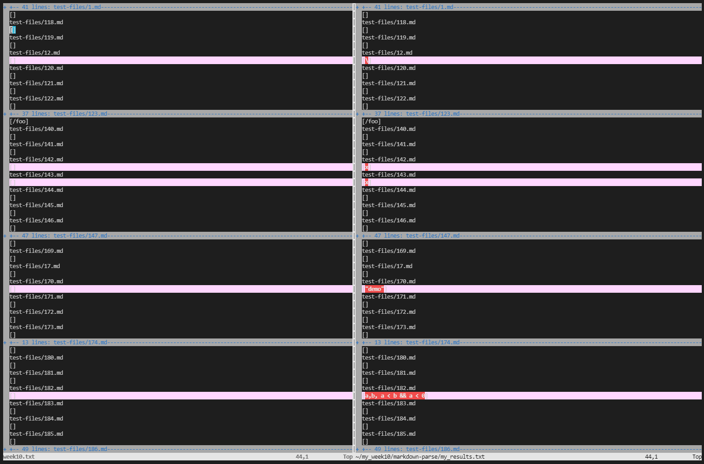
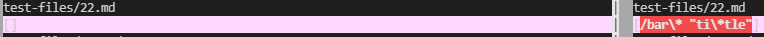
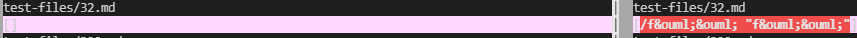

# Lab Report 5, Week 10

## How I found tests with different results
To find the tests with different results, first, I made two different directories, my_week10 and week10. In my_week10, I used `git clone` to put my markdown-parse repo in it, while in week10, I put Professor Politz's markdown-parse repo. I also copied the `test-files` folder with all of the test files into my_week10 using `cp -r week10.txt ~/my_week10/markdown-parse/test-files` in my_week10.

I added bash scripts (contained below) to both my_week10 and week10 directories to print out the respective file and their outputs. 

Then, I ran `bash script.sh > my_results.txt` and `bash script.sh > week10.txt` respectively to get the outputs of running markdownparse on the test-files. 

Afterwards, I ran `diff ~/week10/markdown-parse/week10.txt ~/my_week10/markdown-parse/my_results.txt > differences.txt` to get a text file with the differences between the two output files. I also used `vimdiff ~/week10/markdown-parse/week10.txt ~/my_week10/markdown-parse/my_results.txt` to get a direct side by side view of the differences. 

## Test 1 - [22.md](https://github.com/ucsd-cse15l-w22/markdown-parse/blob/main/test-files/22.md)
(Note: Politz results on left, my results on right)
### Correct Implementation:

### Incorrect Implementation

## Test 2 - [32.md](https://github.com/ucsd-cse15l-w22/markdown-parse/blob/main/test-files/32.md)
(Note: Politz results on left, my results on right)
### Correct Implementation:

### Incorrect Implementation

